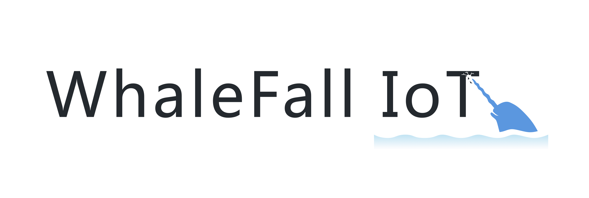
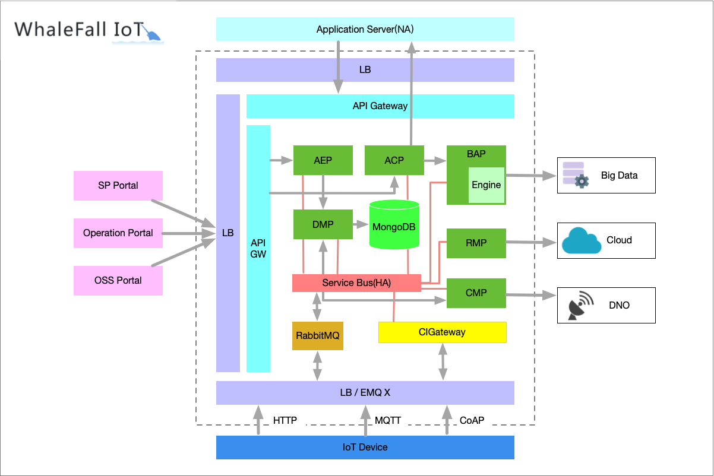
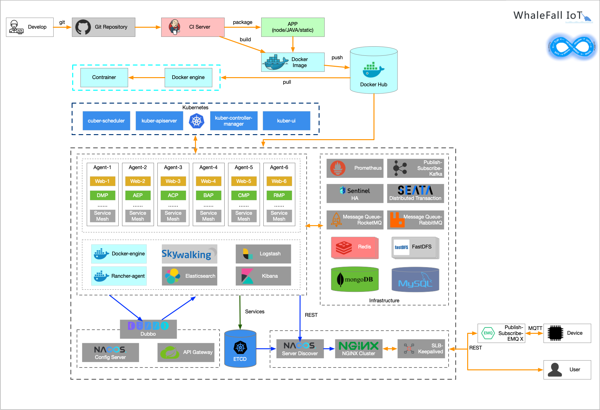
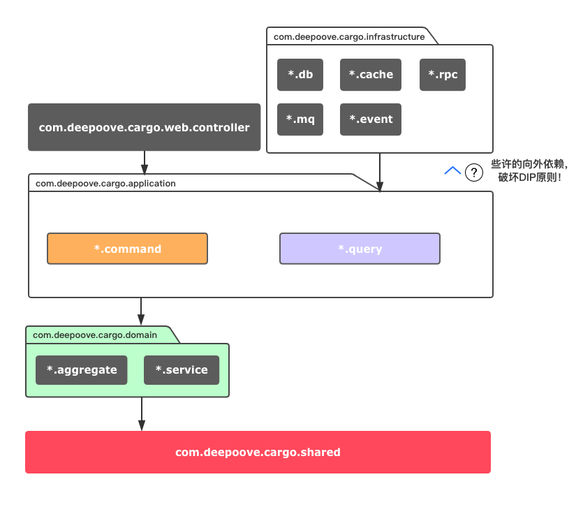

 

# Whale Fall IoT
[](https://github.com/YoXung/whale-fall-iot.git)

### 安装依赖软件
* *MongoDB*

    MongoDB是一个基于分布式文件存储的数据库，我们会把MongoDB作为物联网平台主要的数据存储工具。[传送门](https://www.mongodb.com/download-center/community)

* *Redis*

    Redis是一个高效的内存数据库，物联网平台会使用Redis来实现缓存和简单的队列功能。[传送门](https://redis.io/download)

* *RabbitMQ*

    RabbitMQ是使用Erlang编写的AMQP Broker，物联网平台使用RabbitMQ作为队列系统实现物联网平台内部以及物联网平台到业务系统的异步通信。[传送门](https://www.rabbitmq.com/#getstarted)
    
* *EMQ X*

    EMQ X是一个使用Erlang编写的MQTT Broker，物联网平台使用EMQ X来实现MQTT/CoAP协议接入，并使用EMQ X的一些高级功能来简化和加速开发。[传送门](https://docs.emqx.io/broker/v3/cn/)

* *Node.js*

    Node.js是一个基于 Chrome V8 引擎的 JavaScript 运行环境，我们会使用 Node.js 来开发物联网平台的主要功能。[传送门](https://nodejs.org/en/download/)
    
### 逻辑架构图
 

### DevOps架构图
 

### DDD工程划分依据




### 工程结构
```
whalefall-iot //IoT父工程
|
├── whalefall-iot-acp //应用中心平台
|
├── whalefall-iot-aep //应用使能平台
|
├── whalefall-iot-bap //业务分析平台
|
├── whalefall-iot-cig //边缘网关
|
├── whalefall-iot-cmp //连接管理平台
|
├── whalefall-iot-dmp //设备管理平台
|
├── whalefall-iot-upms //用户权限管理系统
|
├── whalefall-iot-framework //工程通用框架
|
├── whalefall-iot-common //工程通用组件
|
├── whalefall-iot-bff-portal   //BFF平台用户操作前端
|
├── whalefall-iot-bff-console  //BFF平台管理前端
|
├── whalefall-iot-terminal-sample  //终端模拟案例

```